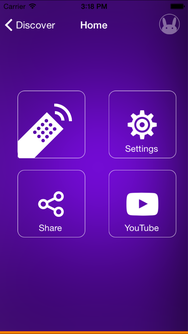
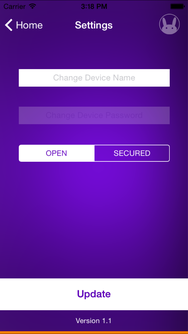
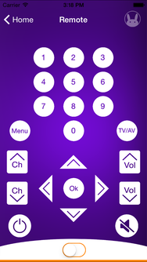

### Tah Remote
The Tah Remote app lets you control all remote-controlled appliances around you by turning your device into a universal remote controller. It takes minutes to sync your existing infrared remote controller with this app with an IR shield attached to the Tah board, and you can then use your iPhone or iPad to remotely control the appliance.  
This repository consists of the iOS and Android(coming soon) source code along with the corresponding Arduino sketch for the Tah Remote app. 
    
---

## Usage

#### Arduino
* Install the [Tah Arduino Library](https://github.com/tah-io/Tah_Arduino_Library#installing)
* Download the [Remote sketch](https://raw.githubusercontent.com/tah-io/Tah-Remote/master/Play/Play.ino)
and open it in the Arduino IDE
* Upload it on your Tah board

#### iOS
* Clone the repo

		git clone https://github.com/tah-io/Tah-Remote.git

* Change directory to the appropriate submodule (iOS or Android)

		cd Tah-Remote-iOS

* Initialize and update the submodule

		git submodule init
		git submodule update
* Open the Xcode project file TAH Remote.xcodeproj 
